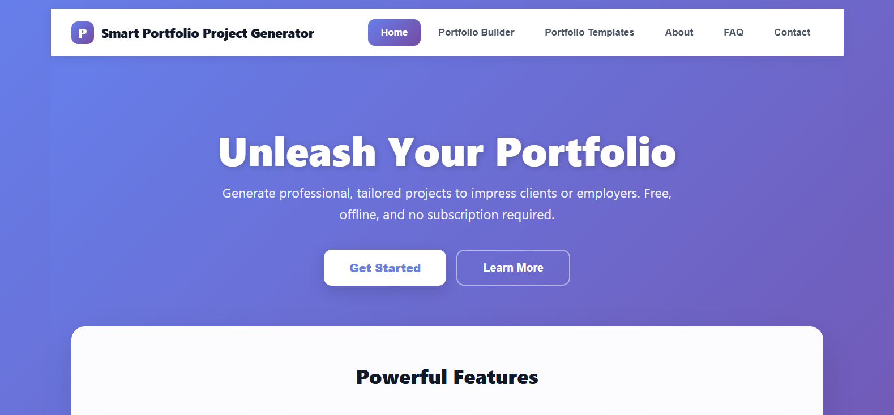
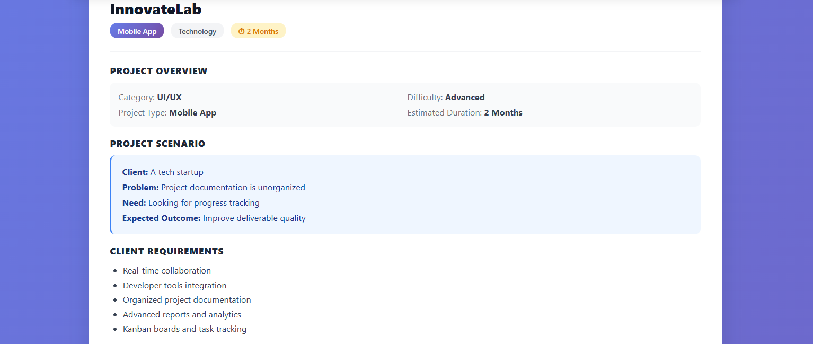

# Smart Portfolio Project Generator

Professional Portfolio Project Generator for Freelancers, Designers, Developers and Creative Professionals.

This application helps users generate polished portfolio project descriptions, case studies, project summaries and presentation-ready content in seconds.

## Features

- Generate professional portfolio project descriptions
- Create engaging project summaries
- Generate objectives
- Generate challenges
- Generate solutions
- Generate project outcomes
- Highlight technologies and tools
- Produce case-study style content
- Copy individual sections
- Copy all generated content
- Export generated results
- Modern responsive interface
- Fast local processing
- No API required
- No Internet connection required after installation

## Perfect For

- UI/UX Designers
- Graphic Designers
- Web Designers
- Web Developers
- Mobile Developers
- Freelancers
- Agencies
- Students
- Creative Professionals

## Screenshots

## How It Works

1. Enter your project information.
2. Choose your preferred options.
3. Generate professional portfolio content.
4. Copy or export the generated results.

## Download & Install Instructions

Download and extract the ZIP file. Make sure Node.js (version 18 or later) is installed on your computer. Open the project folder in Visual Studio Code or your preferred code editor. Open a terminal inside the project folder. Install the required dependencies: npm install Start the development server: npm run dev Open the local URL displayed in the terminal (usually http://localhost:5173) in your web browser.

## Requirements

- Node.js 18+
- npm (included with Node.js)
- Modern Browser
  - Chrome
  - Edge
  - Firefox
  - Safari

## What's Included

When purchasing this product the customer receives:

- Complete application source code
- Modern responsive interface
- Documentation
- Export functionality
- Ready-to-use project
- Lifetime access to the purchased version

## License

This repository exists only for showcasing the product. The complete application source code is available only after purchasing the product. Redistribution or resale is prohibited.

## Purchase

Purchase from the official Payhip store: [https://payhip.com/b/PvtA5](https://payhip.com/your-product-link)
